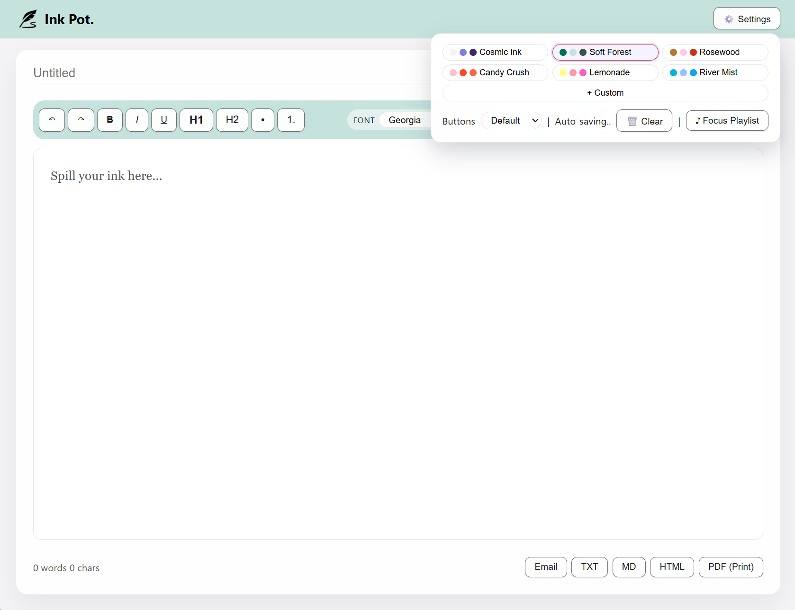
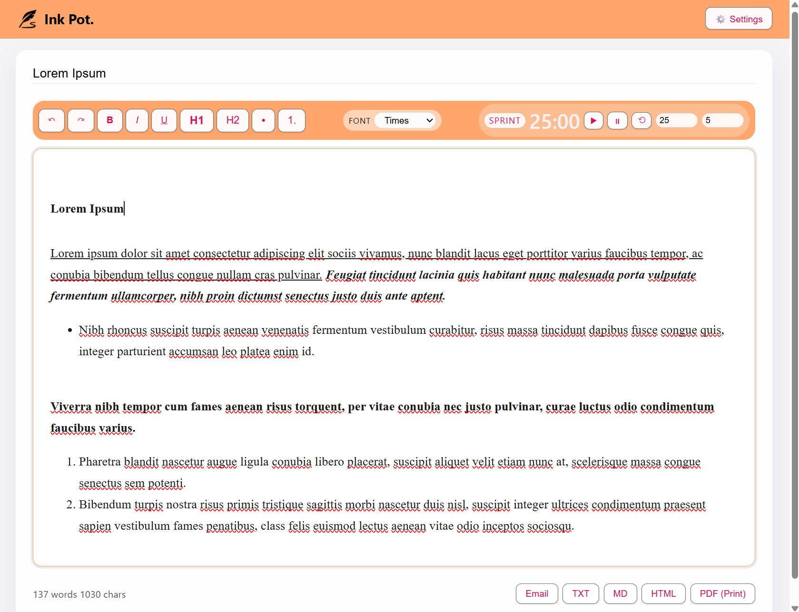

# [](https://img.icons8.com/?size=100&id=hGBTBdUownyO&format=png&color=000000) Ink Pot.

**Ink Pot.** is a focused writing space with a built‑in Pomodoro timer and intuitive visual customization. It’s designed to make it a little easier to sit down, stay on track, and actually finish what you’re writing.

This project was created for the [CodeSprout 2026 Hackathon](https://codesprout-hackathon-2026.devpost.com/).

## Demo

Try it out! [https://ink-pot.vercel.app/](https://ink-pot.vercel.app/)

Demo / Preview:





## Overview 

People often intend to “just write for a bit,” but lose time switching between timer apps, note editors, and browser tabs. This switching makes it harder to get started and to maintain a focused session.

**Ink Pot.** runs entirely in the browser and does not require an account or backend. It combines three ideas in one small, user-friendly page:

- A distraction‑light rich‑text editor

- A compact Pomodoro timer that lives where you write

- Simple and intuitive UX/UI for a pleasant and productive environment

The goal is not to be a full document editor, but a simple, approachable tool that helps someone write for 25 minutes without wandering off.

## Tech Stack

- HTML
- CSS
- JavaScript (no frameworks, no build tools)
- Browser APIs
- Vercel

## Getting Started

You can run **Ink Pot.** locally with just a browser.

1. Download or clone this repository.
```
git clone https://github.com/wong-ja/ink-pot.git
```
2. Open `index.html` in a browser.
3. Start typing in the main editor area.
4. Use the toolbar to format text and control the Pomodoro timer.
5. Export or email your writing when you’re done with a session.

## Usage

1. **Set up your space**
   - Open the Settings menu in the top bar to choose a color palette, button shape, or clear your draft.
   - Use `🗑️ Clear` if you want the browser to discard your current work.

2. **Write**
   - Type directly into the main writing area, and enter a title.
   - Use the toolbar buttons or keyboard shortcuts (eg. `Ctrl+B`, `Ctrl+I`, `Ctrl+U`, `Ctrl+Z`, `Ctrl+Y`) for formatting.

3. **Focus with the Pomodoro timer**
   - In the toolbar, set sprint and break lengths, which runs on a continuous loop.
   - Press play to start a sprint, pause if you need a break, and reset to go back to your default sprint length.

4. **Save or share your work**
   - Export as `.txt`, `.md`, or `.html`, or use the **PDF (print)** option.
   - Use the **Email** button to open an email draft with your text in the body.


## Features

> [!NOTE]
> No backend, no auth, no database. Everything runs in the browser.

### Writing experience

- Rich-text editor with:
  - Bold, italic, underline
  - Headings (H1, H2)
  - Bullet and numbered lists
- Keyboard shortcuts for common actions:
  - Formatting (e.g. Ctrl+B, Ctrl+I, Ctrl+U)
  - Undo / redo (Ctrl+Z / Ctrl+Y)
- Live word and character count
- Pomodoro timer (continuous looping)

### Safety and drafts

- “🗑️ Clear” button:
  - Title and contents are auto-saved to `localStorage`, in case of accidental refresh
  - Draft can be cleared from the settings panel

### Export and sharing

- Export current document as:
  - Plain text (`.txt`)
  - Markdown‑friendly plain text (`.md`)
  - Self‑contained HTML file (`.html`) with basic styling
- “Print to PDF” via the browser’s print dialog
- Email integration:
  - Opens a mail draft with the content in the body via `mailto:`

### Focus and timing

- Compact Pomodoro timer embedded in the editor toolbar:
  - Adjustable sprint and break lengths
  - Start, pause, and reset controls

### Look and feel

- Palette presets to change the overall mood of the page
- Customizable palette 
- Button shape presets (e.g. default, playful shapes) for a more personal UI

### Future ideas (not implemented yet)

- “Focus Playlist” media button in the top bar:
  - Intended to open a public Spotify or YouTube playlist for background music
  - The button is present but non-functional in this version
- Add optional session stats (e.g., number of sprints completed), progress/habit tracker.
- More layout options for the editor (e.g., narrow column vs. full width).
- Floating or pop-out pomodoro timer when tab-switching or window-switching
